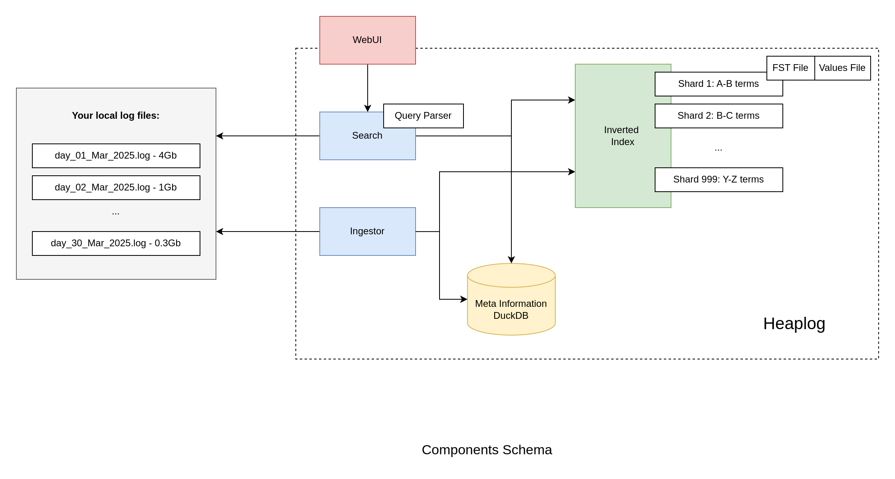

# Search For Local Log Files


[](https://github.com/lezhnev74/heaplog/actions/workflows/go.yml)

# What is Heaplog?

Heaplog is a helper tool that makes searching through your app's log files easy. It works like this:

1. It runs quietly in the background and keeps track of your log files
2. It creates a small index (like a table of contents) to help find things quickly
3. You can search through your logs using a simple web interface and powerful query language

The cool part is that Heaplog is very efficient:

- It only stores the index information, not copies of your actual logs
- Searches are fast thanks to the index
- It takes up very little disk space

The name "Heaplog" comes from how it treats your log files as "heaps" of data that it can quickly search through.

**Table of content:**

- [Installation](#installation)
- [Configuration](#configuration)
- [Query Language](#query-language)
- [Design Ideas](#design)
- [License](#licence)

<a href="https://github.com/lezhnev74/heaplog/blob/main/HeaplogScreenshot.png"></a>

## Features

- Modest on disk space (uses [DuckDB](https://duckdb.org/) + [FST](https://blog.burntsushi.net/transducers/) for terms)
- [Inverted index](https://github.com/lezhnev74/inverted_index_2)
- Powerful query language (prefix match, regular expressions, AND-, OR-, NOT-operators)
- Works best with append-only files (logs and such)
- Supports multi-line free-text log messages
- Runs as a background service: exposes Web UI, runs indexing workers in the background
- Deploys as a docker container



## Query Language

Query language supports prefix matching, regular expressions, and AND-OR-NOT operators. Note that prefix match uses the
index to speed up the query, while regular expression does the full-scan of all files.
To have the best performance, always add at least one prefix match term to the query to help it narrow down the search
area.

**What is the Prefix Match?**
Each message is split in terms, and the beginning of each term is indexed.
Example:
`Error at locahost.domain` will be split in `Error`, `at`, `locahost`, `domain`.
Using the prefix match, it can find this message by the query line `local` but not `host`.
In the latter case we should use regular expression `~host`.

Samples:

| Query (UTF-8)                                                                 | Description                                                                                                                                             |
|-------------------------------------------------------------------------------|---------------------------------------------------------------------------------------------------------------------------------------------------------|
| `error`                                                                       | **Case-insensitive prefix match**. Will find all messages with this sequence of bytes as term prefix.                                                   |
| `"error failure"`, the same as `'error failure'`                              | Quoted exact match. Used to provide a literal with space-like symbols.                                                                                  |
| `error failure`, the same as `failure error`, the same as `error AND failure` | Looks for the presence of both exact matches `error` and `failure`. `AND` operator is assumed for literals. **No order is preserved.**                  |
| `error OR failure`, the same as `failure OR error`                            | OR-union for exact match.                                                                                                                               |
| `(error failure) OR success`                                                  | Supports parenthesis to group literals.                                                                                                                 |
| `!error`, `!(error OR failure)`                                               | Inversion of the expression.                                                                                                                            |
| `~.*`, `~error`, `~(error \d+)`, `~"error \d+"`                               | `~` - **Regular Expression** operator. Everything after `~` is used as a regular expression. Matches against every messaged. It does not use the index. |
| `~error`                                                                      | Case-insensitive regular expression                                                                                                                     
| `@error`                                                                      | Case-sensitive regular expression                                                                                                                       
| `report ~report\d+`                                                           | Combine prefix match with the RE to use the index and improve search performance.                                                                       |

## Installation

### Docker Image

The program comes as a docker image `lezhnev74/heaplog`.
Here is a sample docker-compose config file:

```yaml
services:
  heaplog:
    image: lezhnev74/heaplog
    volumes:
      - /host/path/to/logs:/logs:ro
      - /host/path/to/storage:/storage:rw
      - /host/path/to/heaplog.yml:/heaplog.yml:ro
    entrypoint: [ "/heaplog" ]
    command: [ "run" ]
    ports:
      - 8393:8393
```

Now you can run `docker compose up heaplog` and access the UI at `http://localhost:8393`.

## Configuration

Configuration can be provided as Yaml file, as well as command arguments (where the latter override the former).
Configurable keys and values can be seen in [config.go](https://github.com/lezhnev74/heaplog/blob/main/internal/ui/config.go).
To populate a new empty file run `docker compose run heaplog gen > heaplog.yml`.

Since there are many formats of log files, you have to provide two settings:

1. Regular Expression to find individual messages(config key `MessageStartRE`) in your files.
2. Go Date Format(config key `DateFormat`) to parse timestamps. See [Syntax docs](https://go.dev/src/time/format.go).

**Example Config For PHP App Based On Laravel Framework**

```yaml
# where to look for log files? example: "./*.log"
files_glob_pattern: /logs/*.log
# where to store the index and other data (relative to cwd supported)
storage_path: ./storage
# a regular expression to find the start of messages in a heap file,
# it must contain the date pattern in the first matching group
# example: "^\[(\d{4}-\d{2}-\d{2}T\d{2}:\d{2}:\d{2})\]"
message_start_re: ^\[(\d{4}-\d{2}-\d{2}T\d{2}:\d{2}:\d{2}\.\d{6}[+-]\d{2}:\d{2})\]
# the pattern of a date in a message
# see https://go.dev/src/time/format.go
date_format: "2006-01-02T15:04:05.000000-07:00"
# sets the degree of concurrency in the service (affects ingestion and search),
# defaults to the number of cores if omitted or <1.
concurrency: 8
# Terms are extracted from messages and indexed.
# These control how fast ingestion goes (and space taken for the inverted index),
# as well as how fast search goes (as shorter terms may duplicate in the index).
min_term_len: 4
max_term_len: 8
# Max memory the duckdb instance is allowed to allocate in Mb.
# Increase if you see related errors on big data sets. (default: 500)
duckdb_max_mem_mb: 1000
```

### Use ChatGPT To Detect Format

Use the power of AI to do the job for you :) Use this prompt to get a go code from where you can copy-paste the regular
expression as well as date format for parsing.

```
Detect the full timestamp in this log message. 
Write the regular expression for the date.
Write Go time layout for that date that can be used in time.Parse function.

[2023-12-31T00:00:03.448201+00:00] production.DEBUG: My message
```

### Test Your Config

Once you have configured the app, run this command to make sure everything is ok:
`docker compose run test`.

## Access Control

Heaplog does not include any access control features. That is by design. You could use it by tunneling its port to your
local machine over SSH.
Or use your existing app to authorize access and then redirect to Heaplog (example:
via [nginx internal redirect](https://nginx.org/en/docs/http/ngx_http_internal_redirect_module.html)).

## Design

Read more details about how it works in [this blog post](https://lessthan12ms.com/heaplog.html).

## Licence

MIT